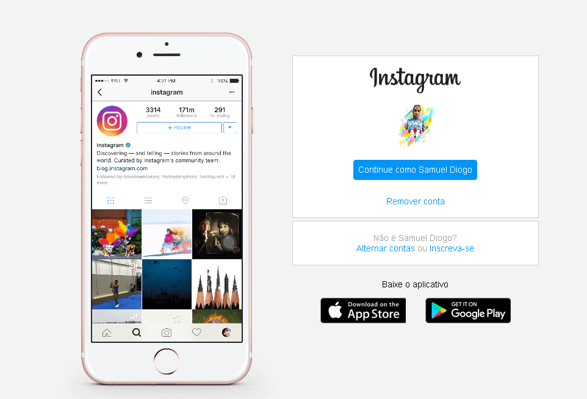

# loginpage-instagram
reconstruindo a página inicial de login do Instagram, abordando o conceito sobre CSS utilizando Flexbox

<h1 align="center">
Projeto DIO - INSTAGRAM (Login page)
</h1>

<a href="https://www.instagram.com/?hl=pt-br">Login Page Homepage</a> for study purposes.

[Sammynauta](https://github.com/Sammynauta)

## Resources

- [x] HTML, CSS.
- [x] Images (JPEG, PNG)
